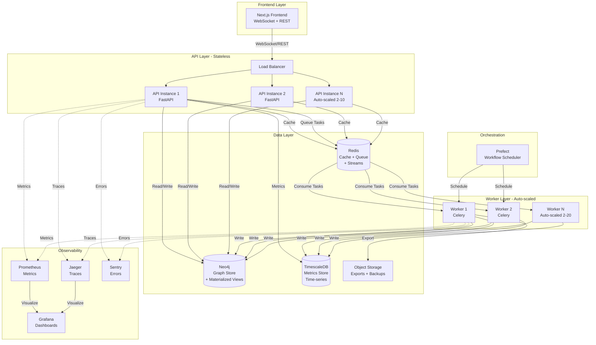
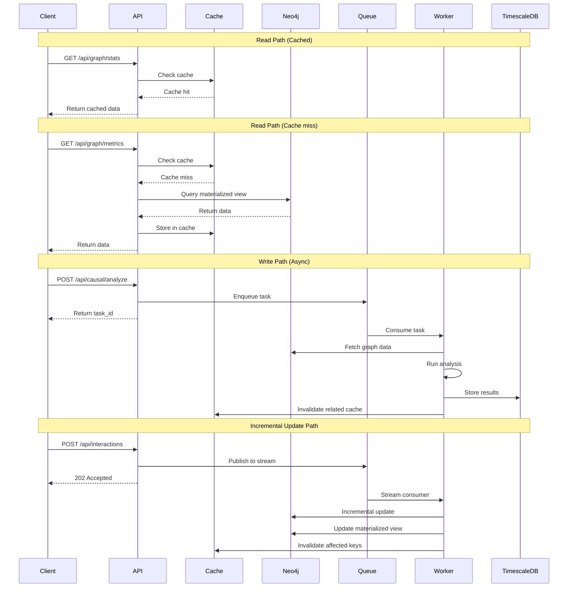

# Design Document: Architecture Scalability Audit

## Overview

This design transforms the Causal Organism platform from a proof-of-concept to a production-ready, horizontally scalable system capable of handling 100x current load (2000 employees, 1.5M interactions/day, 100 concurrent users) while eliminating single points of failure and enabling autonomous operation.

### Current Architecture

**Stack:**
- Backend: Python/FastAPI with Celery workers
- Frontend: Next.js/React
- Data: Neo4j (graph), Redis (queue), TimescaleDB (metrics), PySpark (distributed processing)
- Deployment: Docker Compose (dev), Kubernetes (prod with 2 replicas)

### Target Architecture

**Stateless Services:** API instances store no state, enabling horizontal scaling
**Async Processing:** All long-running operations execute in background workers
**Intelligent Caching:** Multi-layer cache reduces database load by 70%+
**Fault Tolerance:** Circuit breakers, connection pooling, and health checks prevent cascading failures
**Incremental Updates:** Event-driven architecture enables real-time graph updates without full rebuilds
**Production Ready:** Authentication, rate limiting, observability, and automated operations

### Key Design Decisions

1. **State Externalization:** Move all state from API process memory to Redis/Neo4j/TimescaleDB
2. **Event Streaming:** Use Redis Streams for incremental graph updates instead of full rebuilds
3. **Materialized Views:** Pre-compute expensive graph metrics, refresh incrementally
4. **Smart Engine Selection:** Use Pandas for <100K rows, Spark for larger datasets
5. **Multi-Layer Caching:** L1 (in-memory per-instance), L2 (Redis shared), L3 (materialized views)
6. **Circuit Breaker Pattern:** Wrap all external calls with timeout/retry/circuit breaking
7. **Workflow Orchestration:** Use Prefect for scheduled pipelines with dependency management
8. **OpenTelemetry:** Distributed tracing across all services for observability

## Architecture


### System Architecture Diagram



### Data Flow Architecture




## Components and Interfaces

### 1. Stateless API Service

**Purpose:** Handle HTTP requests without storing state in process memory

**Key Changes:**
- Remove global `state` dictionary
- Implement connection pooling for all databases
- Add circuit breakers for external calls
- Add health check endpoints

**Interface:**

```python
class StatelessAPIService:
    def __init__(
        self,
        neo4j_pool: Neo4jConnectionPool,
        redis_pool: RedisConnectionPool,
        timescale_pool: TimescaleConnectionPool,
        cache: CacheLayer,
        circuit_breaker: CircuitBreakerRegistry
    ):
        """Initialize with injected dependencies - no global state"""
        pass
    
    async def get_graph_stats(self) -> GraphStats:
        """Fetch stats from cache or Neo4j materialized view"""
        pass
    
    async def trigger_analysis(self, params: AnalysisParams) -> TaskID:
        """Queue analysis task, return immediately"""
        pass
    
    async def health_live(self) -> HealthStatus:
        """Liveness probe - is process running?"""
        pass
    
    async def health_ready(self) -> HealthStatus:
        """Readiness probe - can handle requests?"""
        pass
```

**Configuration:**

```python
# Connection pool settings
NEO4J_POOL_SIZE = 20  # Max concurrent connections
NEO4J_POOL_TIMEOUT = 5  # Seconds to wait for connection
NEO4J_POOL_MAX_IDLE = 300  # Seconds before closing idle connection

REDIS_POOL_SIZE = 50
REDIS_POOL_TIMEOUT = 2

TIMESCALE_POOL_SIZE = 20
TIMESCALE_POOL_TIMEOUT = 5
```

### 2. Connection Pool Manager

**Purpose:** Manage reusable database connections with health checks

**Implementation:**

```python
class Neo4jConnectionPool:
    def __init__(self, uri: str, user: str, password: str, pool_size: int):
        self.driver = GraphDatabase.driver(
            uri, 
            auth=(user, password),
            max_connection_pool_size=pool_size,
            connection_acquisition_timeout=5.0,
            max_connection_lifetime=3600,
            keep_alive=True
        )
    
    async def execute_read(self, query: str, params: dict) -> List[Record]:
        """Execute read query with automatic retry"""
        async with self.driver.session() as session:
            return await session.run(query, params)
    
    async def execute_write(self, query: str, params: dict) -> Summary:
        """Execute write query with automatic retry"""
        async with self.driver.session() as session:
            return await session.run(query, params)
    
    async def health_check(self) -> bool:
        """Verify connection pool health"""
        try:
            await self.execute_read("RETURN 1", {})
            return True
        except Exception:
            return False
```

### 3. Multi-Layer Cache

**Purpose:** Reduce database load through intelligent caching

**Architecture:**

```python
class CacheLayer:
    def __init__(self, redis_pool: RedisConnectionPool):
        self.redis = redis_pool
        self.local_cache = TTLCache(maxsize=1000, ttl=60)  # L1: In-memory
        self.redis_ttl = 3600  # L2: Redis (1 hour)
    
    async def get(self, key: str) -> Optional[Any]:
        """
        L1: Check local in-memory cache (fast, per-instance)
        L2: Check Redis (shared across instances)
        L3: Return None (caller fetches from DB/materialized view)
        """
        # L1 check
        if key in self.local_cache:
            return self.local_cache[key]
        
        # L2 check
        value = await self.redis.get(key)
        if value:
            self.local_cache[key] = value  # Populate L1
            return value
        
        return None
    
    async def set(self, key: str, value: Any, ttl: int = None):
        """Store in both L1 and L2"""
        self.local_cache[key] = value
        await self.redis.setex(key, ttl or self.redis_ttl, value)
    
    async def invalidate(self, pattern: str):
        """Invalidate cache entries matching pattern"""
        # Clear L1
        keys_to_delete = [k for k in self.local_cache if fnmatch(k, pattern)]
        for key in keys_to_delete:
            del self.local_cache[key]
        
        # Clear L2
        await self.redis.delete_pattern(pattern)
    
    def cache_key(self, namespace: str, **kwargs) -> str:
        """Generate consistent cache key"""
        sorted_params = sorted(kwargs.items())
        param_str = ":".join(f"{k}={v}" for k, v in sorted_params)
        return f"{namespace}:{param_str}"
```

**Cache Key Strategy:**

```python
# Graph stats: cache for 5 minutes
cache_key("graph:stats")

# Employee metrics: cache for 1 hour, invalidate on graph update
cache_key("metrics:employee", employee_id="emp_123")

# Causal analysis: cache for 1 hour, include data version
cache_key("analysis:causal", params_hash="abc123", data_version="v42")

# Trend data: cache for 15 minutes
cache_key("trends:burnout", employee_id="emp_123", days=90)
```

### 4. Circuit Breaker

**Purpose:** Prevent cascading failures from external service outages

**Implementation:**

```python
class CircuitBreaker:
    def __init__(
        self,
        failure_threshold: int = 5,
        success_threshold: int = 2,
        timeout: float = 5.0,
        recovery_timeout: float = 60.0
    ):
        self.state = "CLOSED"  # CLOSED, OPEN, HALF_OPEN
        self.failure_count = 0
        self.success_count = 0
        self.last_failure_time = None
        self.failure_threshold = failure_threshold
        self.success_threshold = success_threshold
        self.timeout = timeout
        self.recovery_timeout = recovery_timeout
    
    async def call(self, func: Callable, *args, **kwargs):
        """Execute function with circuit breaker protection"""
        if self.state == "OPEN":
            if time.time() - self.last_failure_time > self.recovery_timeout:
                self.state = "HALF_OPEN"
                self.success_count = 0
            else:
                raise CircuitBreakerOpenError("Circuit breaker is OPEN")
        
        try:
            result = await asyncio.wait_for(
                func(*args, **kwargs),
                timeout=self.timeout
            )
            self._on_success()
            return result
        except Exception as e:
            self._on_failure()
            raise
    
    def _on_success(self):
        self.failure_count = 0
        if self.state == "HALF_OPEN":
            self.success_count += 1
            if self.success_count >= self.success_threshold:
                self.state = "CLOSED"
    
    def _on_failure(self):
        self.failure_count += 1
        self.last_failure_time = time.time()
        if self.failure_count >= self.failure_threshold:
            self.state = "OPEN"

class CircuitBreakerRegistry:
    """Manage circuit breakers per external service"""
    def __init__(self):
        self.breakers = {}
    
    def get(self, service_name: str) -> CircuitBreaker:
        if service_name not in self.breakers:
            self.breakers[service_name] = CircuitBreaker()
        return self.breakers[service_name]
```


### 5. Event-Driven Graph Builder

**Purpose:** Process incremental graph updates via event streaming

**Architecture:**

```python
class EventDrivenGraphBuilder:
    def __init__(
        self,
        neo4j_pool: Neo4jConnectionPool,
        redis_stream: RedisStream,
        cache: CacheLayer
    ):
        self.neo4j = neo4j_pool
        self.stream = redis_stream
        self.cache = cache
    
    async def publish_interaction(self, interaction: Interaction):
        """Publish interaction event to stream"""
        await self.stream.xadd(
            "interactions",
            {
                "source": interaction.source,
                "target": interaction.target,
                "type": interaction.type,
                "weight": interaction.weight,
                "timestamp": interaction.timestamp
            }
        )
    
    async def consume_interactions(self):
        """Consumer loop for incremental graph updates"""
        consumer_group = "graph_builder"
        consumer_name = f"builder_{os.getpid()}"
        
        # Create consumer group if not exists
        await self.stream.xgroup_create(
            "interactions", 
            consumer_group, 
            mkstream=True
        )
        
        while True:
            # Read batch of events
            events = await self.stream.xreadgroup(
                consumer_group,
                consumer_name,
                {"interactions": ">"},
                count=100,
                block=5000
            )
            
            for stream_name, messages in events:
                for message_id, data in messages:
                    await self._process_interaction(data)
                    await self.stream.xack("interactions", consumer_group, message_id)
    
    async def _process_interaction(self, data: dict):
        """Apply incremental update to graph"""
        query = """
        MATCH (source:Employee {id: $source})
        MATCH (target:Employee {id: $target})
        MERGE (source)-[r:INTERACTS]->(target)
        ON CREATE SET r.weight = $weight, r.last_updated = timestamp()
        ON MATCH SET r.weight = r.weight + $weight, r.last_updated = timestamp()
        
        // Incrementally update degree centrality for affected nodes
        WITH source, target
        CALL {
            WITH source
            MATCH (source)-[r]-()
            WITH source, count(r) as degree
            MATCH (all:Employee)
            WITH source, degree, count(all) as total
            SET source.degree_centrality = toFloat(degree) / (total - 1)
        }
        CALL {
            WITH target
            MATCH (target)-[r]-()
            WITH target, count(r) as degree
            MATCH (all:Employee)
            WITH target, degree, count(all) as total
            SET target.degree_centrality = toFloat(degree) / (total - 1)
        }
        """
        
        await self.neo4j.execute_write(query, data)
        
        # Invalidate cache for affected employees
        await self.cache.invalidate(f"metrics:employee:{data['source']}")
        await self.cache.invalidate(f"metrics:employee:{data['target']}")
        await self.cache.invalidate("graph:stats")
```

### 6. Materialized View Manager

**Purpose:** Pre-compute expensive graph metrics for fast queries

**Implementation:**

```python
class MaterializedViewManager:
    def __init__(self, neo4j_pool: Neo4jConnectionPool):
        self.neo4j = neo4j_pool
    
    async def create_views(self):
        """Create materialized views for graph metrics"""
        
        # View 1: Degree centrality (updated incrementally)
        # Already stored as node property in incremental updates
        
        # View 2: Betweenness centrality (expensive, scheduled refresh)
        await self.neo4j.execute_write("""
            CALL gds.graph.project(
                'org_graph',
                'Employee',
                'INTERACTS',
                {relationshipProperties: 'weight'}
            )
        """)
        
        await self.neo4j.execute_write("""
            CALL gds.betweenness.write('org_graph', {
                writeProperty: 'betweenness_centrality'
            })
        """)
        
        # View 3: Clustering coefficient
        await self.neo4j.execute_write("""
            CALL gds.localClusteringCoefficient.write('org_graph', {
                writeProperty: 'clustering_coeff'
            })
        """)
    
    async def refresh_expensive_metrics(self):
        """Scheduled refresh of expensive metrics (hourly)"""
        # Drop and recreate graph projection
        await self.neo4j.execute_write("CALL gds.graph.drop('org_graph', false)")
        await self.create_views()
    
    async def get_employee_metrics(self, employee_id: str) -> dict:
        """Fast query from materialized views"""
        query = """
        MATCH (e:Employee {id: $employee_id})
        RETURN 
            e.id as employee_id,
            e.name as name,
            e.team as team,
            e.role as role,
            e.is_manager as is_manager,
            e.degree_centrality as degree_centrality,
            e.betweenness_centrality as betweenness_centrality,
            e.clustering_coeff as clustering_coeff
        """
        result = await self.neo4j.execute_read(query, {"employee_id": employee_id})
        return result[0] if result else None
```

### 7. Intelligent Causal Engine

**Purpose:** Select appropriate processing engine based on data size

**Implementation:**

```python
class IntelligentCausalEngine:
    def __init__(self):
        self.pandas_engine = CausalEngine()
        self.spark_engine = None  # Lazy initialization
        self.threshold = 100_000  # Rows
    
    async def analyze(self, data_source: str, params: dict) -> dict:
        """
        Determine data size and select engine
        
        Args:
            data_source: "neo4j" or "timescale"
            params: Query parameters
        """
        # Get row count without fetching data
        row_count = await self._get_row_count(data_source, params)
        
        if row_count < self.threshold:
            # Use Pandas for small datasets
            df = await self._fetch_pandas(data_source, params)
            return self.pandas_engine.analyze(df)
        else:
            # Use Spark for large datasets
            if not self.spark_engine:
                self.spark_engine = DistributedCausalEngine()
            
            # Fetch directly into Spark (avoid Pandas conversion)
            spark_df = await self._fetch_spark(data_source, params)
            return self.spark_engine.analyze_spark_df(spark_df)
    
    async def _get_row_count(self, source: str, params: dict) -> int:
        """Get row count without fetching data"""
        if source == "neo4j":
            query = "MATCH (e:Employee) RETURN count(e) as count"
            result = await neo4j_pool.execute_read(query, {})
            return result[0]["count"]
        else:
            query = "SELECT COUNT(*) FROM employee_metrics"
            result = await timescale_pool.execute_read(query, {})
            return result[0][0]
    
    async def _fetch_spark(self, source: str, params: dict):
        """Fetch data directly into Spark DataFrame"""
        if source == "neo4j":
            return self.spark_engine.spark.read.format("org.neo4j.spark.DataSource") \
                .option("url", NEO4J_URL) \
                .option("authentication.type", "basic") \
                .option("authentication.basic.username", NEO4J_USER) \
                .option("authentication.basic.password", NEO4J_PASSWORD) \
                .option("query", "MATCH (e:Employee) RETURN e") \
                .load()
        else:
            return self.spark_engine.spark.read.jdbc(
                url=TIMESCALE_URL,
                table="employee_metrics",
                properties={"user": TIMESCALE_USER, "password": TIMESCALE_PASSWORD}
            )
```


### 8. Async Export Service

**Purpose:** Handle large data exports without blocking API requests

**Implementation:**

```python
class AsyncExportService:
    def __init__(
        self,
        celery_app: Celery,
        s3_client: S3Client,
        cache: CacheLayer
    ):
        self.celery = celery_app
        self.s3 = s3_client
        self.cache = cache
    
    async def request_export(
        self,
        export_type: str,
        params: dict,
        user_id: str
    ) -> str:
        """Queue export task and return task ID"""
        task = export_employee_metrics.delay(
            export_type=export_type,
            params=params,
            user_id=user_id
        )
        return task.id
    
    async def get_export_status(self, task_id: str) -> dict:
        """Check export task status"""
        task = AsyncResult(task_id)
        
        if task.ready():
            if task.successful():
                # Generate signed URL for download
                s3_key = task.result["s3_key"]
                download_url = self.s3.generate_presigned_url(
                    'get_object',
                    Params={'Bucket': EXPORT_BUCKET, 'Key': s3_key},
                    ExpiresIn=86400  # 24 hours
                )
                return {
                    "status": "completed",
                    "download_url": download_url,
                    "expires_at": time.time() + 86400
                }
            else:
                return {
                    "status": "failed",
                    "error": str(task.result)
                }
        else:
            return {
                "status": "processing",
                "progress": task.info.get("progress", 0) if task.info else 0
            }

@celery_app.task(bind=True)
def export_employee_metrics(self, export_type: str, params: dict, user_id: str):
    """Background task for data export"""
    try:
        # Fetch data
        df = fetch_employee_metrics(params)
        
        # Update progress
        self.update_state(state='PROGRESS', meta={'progress': 50})
        
        # Write to temporary file
        temp_file = f"/tmp/export_{self.request.id}.csv"
        df.to_csv(temp_file, index=False)
        
        # Upload to S3
        s3_key = f"exports/{user_id}/{self.request.id}.csv"
        s3_client.upload_file(temp_file, EXPORT_BUCKET, s3_key)
        
        # Clean up temp file
        os.remove(temp_file)
        
        # Update progress
        self.update_state(state='PROGRESS', meta={'progress': 100})
        
        return {"s3_key": s3_key}
    except Exception as e:
        self.update_state(state='FAILURE', meta={'error': str(e)})
        raise
```

### 9. Action Orchestrator with Safety Rails

**Purpose:** Execute autonomous interventions with approval workflow and rollback

**Implementation:**

```python
class SafeActionOrchestrator:
    def __init__(
        self,
        neo4j_pool: Neo4jConnectionPool,
        timescale_pool: TimescaleConnectionPool,
        circuit_breaker: CircuitBreakerRegistry
    ):
        self.neo4j = neo4j_pool
        self.timescale = timescale_pool
        self.circuit_breaker = circuit_breaker
        self.audit_log = AuditLog(timescale_pool)
    
    async def propose_intervention(
        self,
        intervention_type: str,
        target_employee_id: str,
        params: dict,
        reason: str
    ) -> str:
        """Propose intervention and determine if approval needed"""
        
        impact_level = self._assess_impact(intervention_type, params)
        
        intervention = Intervention(
            id=str(uuid.uuid4()),
            type=intervention_type,
            target=target_employee_id,
            params=params,
            reason=reason,
            impact_level=impact_level,
            status="pending_approval" if impact_level == "high" else "approved",
            proposed_at=datetime.utcnow()
        )
        
        # Store in database
        await self._store_intervention(intervention)
        
        # Log proposal
        await self.audit_log.log(
            action="intervention_proposed",
            intervention_id=intervention.id,
            details=intervention.dict()
        )
        
        # Auto-execute low/medium impact
        if impact_level != "high":
            await self.execute_intervention(intervention.id)
        
        return intervention.id
    
    def _assess_impact(self, intervention_type: str, params: dict) -> str:
        """Classify intervention impact level"""
        high_impact_types = [
            "reassign_manager",
            "team_restructure",
            "role_change"
        ]
        
        medium_impact_types = [
            "reduce_meetings",
            "redistribute_tasks"
        ]
        
        if intervention_type in high_impact_types:
            return "high"
        elif intervention_type in medium_impact_types:
            return "medium"
        else:
            return "low"
    
    async def execute_intervention(self, intervention_id: str):
        """Execute approved intervention with rollback capability"""
        intervention = await self._get_intervention(intervention_id)
        
        if intervention.status != "approved":
            raise ValueError("Intervention not approved")
        
        # Store pre-intervention state for rollback
        rollback_data = await self._capture_state(intervention)
        
        try:
            # Execute intervention
            result = await self._execute_action(intervention)
            
            # Update status
            intervention.status = "executed"
            intervention.executed_at = datetime.utcnow()
            intervention.result = result
            await self._update_intervention(intervention)
            
            # Log execution
            await self.audit_log.log(
                action="intervention_executed",
                intervention_id=intervention.id,
                result=result
            )
            
            # Schedule outcome monitoring
            await self._schedule_outcome_monitoring(intervention, rollback_data)
            
        except Exception as e:
            # Log failure
            await self.audit_log.log(
                action="intervention_failed",
                intervention_id=intervention.id,
                error=str(e)
            )
            
            intervention.status = "failed"
            intervention.error = str(e)
            await self._update_intervention(intervention)
            raise
    
    async def _schedule_outcome_monitoring(
        self,
        intervention: Intervention,
        rollback_data: dict
    ):
        """Monitor intervention outcomes and auto-rollback if negative"""
        # Schedule task to check outcomes after 7 days
        monitor_intervention_outcome.apply_async(
            args=[intervention.id, rollback_data],
            countdown=7 * 86400  # 7 days
        )
    
    async def rollback_intervention(self, intervention_id: str):
        """Rollback intervention to pre-execution state"""
        intervention = await self._get_intervention(intervention_id)
        rollback_data = intervention.rollback_data
        
        if not rollback_data:
            raise ValueError("No rollback data available")
        
        # Execute rollback
        await self._restore_state(rollback_data)
        
        # Update status
        intervention.status = "rolled_back"
        intervention.rolled_back_at = datetime.utcnow()
        await self._update_intervention(intervention)
        
        # Log rollback
        await self.audit_log.log(
            action="intervention_rolled_back",
            intervention_id=intervention.id
        )

class AuditLog:
    """Immutable audit trail for all interventions"""
    def __init__(self, timescale_pool: TimescaleConnectionPool):
        self.db = timescale_pool
    
    async def log(self, action: str, intervention_id: str, **kwargs):
        """Write audit log entry"""
        query = """
        INSERT INTO intervention_audit_log 
        (timestamp, action, intervention_id, details)
        VALUES (NOW(), $1, $2, $3)
        """
        await self.db.execute_write(
            query,
            [action, intervention_id, json.dumps(kwargs)]
        )
    
    async def query(
        self,
        start_date: datetime,
        end_date: datetime,
        filters: dict = None
    ) -> List[dict]:
        """Query audit log with filters"""
        query = """
        SELECT * FROM intervention_audit_log
        WHERE timestamp BETWEEN $1 AND $2
        """
        # Add filters...
        return await self.db.execute_read(query, [start_date, end_date])
```


### 10. Workflow Orchestration with Prefect

**Purpose:** Automate data pipeline execution with scheduling and dependency management

**Implementation:**

```python
from prefect import flow, task
from prefect.deployments import Deployment
from prefect.server.schemas.schedules import CronSchedule

@task(retries=3, retry_delay_seconds=60)
async def fetch_interactions():
    """Fetch new interactions from data sources"""
    # Implementation
    pass

@task(retries=3, retry_delay_seconds=60)
async def update_graph_incremental(interactions):
    """Apply incremental graph updates"""
    # Implementation
    pass

@task(retries=2, retry_delay_seconds=300)
async def refresh_materialized_views():
    """Refresh expensive graph metrics"""
    # Implementation
    pass

@task(retries=3, retry_delay_seconds=60)
async def run_causal_analysis():
    """Execute causal analysis"""
    # Implementation
    pass

@task(retries=3, retry_delay_seconds=60)
async def store_metrics(analysis_results):
    """Store results in TimescaleDB"""
    # Implementation
    pass

@task(retries=2, retry_delay_seconds=60)
async def evaluate_interventions(analysis_results):
    """Propose interventions based on analysis"""
    # Implementation
    pass

@flow(name="incremental-update-pipeline")
async def incremental_update_flow():
    """Run every 5 minutes - process new interactions"""
    interactions = await fetch_interactions()
    await update_graph_incremental(interactions)

@flow(name="full-analysis-pipeline")
async def full_analysis_flow():
    """Run every 6 hours - complete analysis cycle"""
    # Refresh expensive metrics
    await refresh_materialized_views()
    
    # Run analysis
    results = await run_causal_analysis()
    
    # Store results
    await store_metrics(results)
    
    # Evaluate interventions
    await evaluate_interventions(results)

# Deploy with schedules
incremental_deployment = Deployment.build_from_flow(
    flow=incremental_update_flow,
    name="incremental-updates",
    schedule=CronSchedule(cron="*/5 * * * *"),  # Every 5 minutes
    work_queue_name="default"
)

full_analysis_deployment = Deployment.build_from_flow(
    flow=full_analysis_flow,
    name="full-analysis",
    schedule=CronSchedule(cron="0 */6 * * *"),  # Every 6 hours
    work_queue_name="default"
)
```

## Data Models

### Graph Data Model (Neo4j)

```cypher
// Employee Node
(:Employee {
    id: String,              // Unique identifier
    name: String,
    team: String,
    role: String,
    is_manager: Integer,     // 0 or 1
    
    // Materialized metrics (updated incrementally or on schedule)
    degree_centrality: Float,
    betweenness_centrality: Float,
    clustering_coeff: Float,
    
    // Metadata
    created_at: DateTime,
    updated_at: DateTime
})

// Interaction Relationship
(:Employee)-[:INTERACTS {
    weight: Integer,         // Accumulated interaction strength
    last_updated: DateTime,
    interaction_count: Integer
}]->(:Employee)

// Indexes for performance
CREATE INDEX employee_id FOR (e:Employee) ON (e.id)
CREATE INDEX employee_team FOR (e:Employee) ON (e.team)
CREATE INDEX employee_role FOR (e:Employee) ON (e.role)
```

### Time-Series Data Model (TimescaleDB)

```sql
-- Employee metrics history
CREATE TABLE employee_metrics (
    timestamp TIMESTAMPTZ NOT NULL,
    employee_id VARCHAR(50) NOT NULL,
    degree_centrality FLOAT,
    betweenness_centrality FLOAT,
    clustering_coeff FLOAT,
    burnout_score FLOAT,
    PRIMARY KEY (timestamp, employee_id)
);

-- Convert to hypertable for time-series optimization
SELECT create_hypertable('employee_metrics', 'timestamp');

-- Automatic data retention and downsampling
SELECT add_retention_policy('employee_metrics', INTERVAL '90 days');

-- Continuous aggregate for hourly data
CREATE MATERIALIZED VIEW employee_metrics_hourly
WITH (timescaledb.continuous) AS
SELECT 
    time_bucket('1 hour', timestamp) AS hour,
    employee_id,
    AVG(degree_centrality) as avg_degree_centrality,
    AVG(betweenness_centrality) as avg_betweenness_centrality,
    AVG(clustering_coeff) as avg_clustering_coeff,
    AVG(burnout_score) as avg_burnout_score,
    MAX(burnout_score) as max_burnout_score
FROM employee_metrics
GROUP BY hour, employee_id;

-- Intervention audit log
CREATE TABLE intervention_audit_log (
    timestamp TIMESTAMPTZ NOT NULL,
    action VARCHAR(50) NOT NULL,
    intervention_id UUID NOT NULL,
    details JSONB,
    PRIMARY KEY (timestamp, intervention_id)
);

SELECT create_hypertable('intervention_audit_log', 'timestamp');

-- Intervention state
CREATE TABLE interventions (
    id UUID PRIMARY KEY,
    type VARCHAR(50) NOT NULL,
    target_employee_id VARCHAR(50) NOT NULL,
    params JSONB,
    reason TEXT,
    impact_level VARCHAR(20),
    status VARCHAR(20),
    proposed_at TIMESTAMPTZ,
    approved_at TIMESTAMPTZ,
    executed_at TIMESTAMPTZ,
    rolled_back_at TIMESTAMPTZ,
    result JSONB,
    rollback_data JSONB,
    error TEXT
);

CREATE INDEX interventions_status ON interventions(status);
CREATE INDEX interventions_target ON interventions(target_employee_id);
```

### Cache Data Model (Redis)

```python
# Cache keys structure
{
    # Graph stats (TTL: 5 minutes)
    "graph:stats": {
        "node_count": 2000,
        "edge_count": 15000,
        "density": 0.0075
    },
    
    # Employee metrics (TTL: 1 hour)
    "metrics:employee:emp_123": {
        "employee_id": "emp_123",
        "name": "John Doe",
        "degree_centrality": 0.15,
        "betweenness_centrality": 0.08,
        "clustering_coeff": 0.42,
        "burnout_score": 65.3
    },
    
    # Causal analysis results (TTL: 1 hour)
    "analysis:causal:hash_abc123:v42": {
        "coefficients": {...},
        "p_values": {...},
        "r_squared": 0.73
    },
    
    # Rate limiting (TTL: 1 minute)
    "ratelimit:user:user_123": {
        "count": 45,
        "window_start": 1234567890
    },
    
    # Circuit breaker state
    "circuit:mockapi": {
        "state": "CLOSED",
        "failure_count": 0,
        "last_failure": null
    }
}

# Redis Streams for event processing
# Stream: interactions
XADD interactions * source emp_123 target emp_456 type slack_message weight 1 timestamp 1234567890

# Consumer groups
XGROUP CREATE interactions graph_builder 0 MKSTREAM
XGROUP CREATE interactions metrics_updater 0 MKSTREAM
```


## Correctness Properties

A property is a characteristic or behavior that should hold true across all valid executions of a system—essentially, a formal statement about what the system should do. Properties serve as the bridge between human-readable specifications and machine-verifiable correctness guarantees.

### Property Reflection

After analyzing all acceptance criteria, I identified several areas where properties can be consolidated:

**Redundancy Analysis:**
- Properties about connection pool behavior (3.5, 3.7) can be combined into comprehensive connection pool properties
- Properties about performance bounds (2.1, 7.3, 8.6, 9.6, 11.2, 12.7) should remain separate as they test different components
- Properties about circuit breaker behavior (5.4, 5.5) test different aspects and should remain separate
- Properties about auto-scaling (4.2, 13.2) test different triggers and should remain separate
- Properties about cache behavior (10.3, 10.4) test different aspects (hit vs invalidation) and should remain separate

**Consolidated Properties:**
- Connection pool properties combined into single comprehensive property
- Rate limiting properties (20.1, 20.4) - keep separate as one tests enforcement, other tests response format

### Core System Properties

**Property 1: Stateless API Instances**

*For any* API service instance and any graph data, the instance SHALL NOT store graph data in process memory, and all graph data SHALL be retrievable from external storage (Neo4j or Redis cache).

**Validates: Requirements 1.1**

**Property 2: System Resilience to Restarts**

*For any* system state with stored data, when an API service instance restarts, all previously stored data SHALL remain accessible and queryable without loss.

**Validates: Requirements 1.4**

**Property 3: Multi-Instance Consistency**

*For any* query and any two API service instances, both instances SHALL return identical results when processing the same query against the same data version.

**Validates: Requirements 1.5**

**Property 4: Fast Startup Time**

*For any* API service instance startup, the instance SHALL become ready to serve requests within 2 seconds of process start.

**Validates: Requirements 2.1**

**Property 5: Connection Pool Reuse and Queueing**

*For any* sequence of database requests, the connection pool SHALL reuse idle connections instead of creating new ones, and when the pool is exhausted, requests SHALL queue with timeout rather than fail immediately.

**Validates: Requirements 3.5, 3.7**

**Property 6: Auto-Scaling Based on Queue Depth**

*For any* worker pool state, when queue depth exceeds 50 tasks, the system SHALL automatically increase worker count, and when queue depth falls below 10 tasks, the system SHALL decrease worker count.

**Validates: Requirements 4.2**

**Property 7: Task Redistribution on Worker Failure**

*For any* worker pool with multiple workers and pending tasks, when a worker instance fails, all tasks assigned to that worker SHALL be redistributed to healthy workers without loss.

**Validates: Requirements 4.5**

**Property 8: Circuit Breaker Retry Logic**

*For any* external API call that fails, the circuit breaker SHALL retry the call with exponential backoff up to 3 attempts before marking the call as failed.

**Validates: Requirements 5.4**

**Property 9: Circuit Breaker State Transitions**

*For any* external API endpoint, when the failure rate exceeds 50% over 10 requests, the circuit breaker SHALL transition to OPEN state for 60 seconds, preventing further calls.

**Validates: Requirements 5.5**

**Property 10: Frontend Polling Rate Limit**

*For any* frontend client session, the client SHALL NOT send polling requests more frequently than once per 30 seconds.

**Validates: Requirements 6.1**

**Property 11: Incremental Graph Updates**

*For any* new interaction event, the graph builder SHALL update only the affected source and target nodes and their connecting edge, leaving all other graph elements unchanged.

**Validates: Requirements 7.2**

**Property 12: Incremental Update Performance**

*For any* interaction event, the graph builder SHALL complete the incremental update within 100 milliseconds.

**Validates: Requirements 7.3**

**Property 13: Materialized View Usage**

*For any* graph metrics query, the API service SHALL retrieve data from materialized views rather than computing centrality metrics on demand.

**Validates: Requirements 8.5**

**Property 14: Graph Metrics Query Performance**

*For any* graph with up to 10,000 nodes, the API service SHALL return graph metrics within 500 milliseconds.

**Validates: Requirements 8.6**

**Property 15: Intelligent Engine Selection**

*For any* dataset, the causal engine SHALL use Pandas when row count is less than 100,000 and SHALL use Spark when row count is 100,000 or greater.

**Validates: Requirements 9.1**

**Property 16: Small Dataset Analysis Performance**

*For any* dataset with fewer than 100,000 rows, the causal engine SHALL complete analysis within 5 seconds.

**Validates: Requirements 9.6**

**Property 17: Cache Hit Behavior**

*For any* analysis request with parameters and data version, when cached results exist for those parameters and the data version has not changed, the causal engine SHALL return cached results without recomputation.

**Validates: Requirements 10.3**

**Property 18: Cache Invalidation on Data Change**

*For any* graph data modification, the cache layer SHALL invalidate all cached results that depend on the modified data.

**Validates: Requirements 10.4**

**Property 19: Async Export Response Time**

*For any* export request, the API service SHALL return a task ID and status URL within 500 milliseconds.

**Validates: Requirements 11.2**

**Property 20: Historical Query Routing**

*For any* historical trend query, the API service SHALL query the TimescaleDB metrics store rather than computing trends from current graph state.

**Validates: Requirements 12.6**

**Property 21: Historical Query Performance**

*For any* 90-day trend query, the API service SHALL return results within 1 second.

**Validates: Requirements 12.7**

**Property 22: CPU-Based Auto-Scaling**

*For any* API service deployment, when average CPU utilization across instances exceeds 70%, Kubernetes SHALL add replicas, and when utilization falls below 30%, Kubernetes SHALL remove replicas.

**Validates: Requirements 13.2**

**Property 23: High-Impact Intervention Approval**

*For any* proposed intervention classified as high impact, the action orchestrator SHALL require human approval before execution.

**Validates: Requirements 14.2**

**Property 24: Automatic Rollback on Negative Outcomes**

*For any* executed intervention that produces negative outcomes, the action orchestrator SHALL automatically execute the rollback procedure to restore pre-intervention state.

**Validates: Requirements 14.5**

**Property 25: Pipeline Task Retry Logic**

*For any* pipeline task that fails, the workflow orchestrator SHALL retry the task up to 3 times with exponential backoff before marking it as permanently failed.

**Validates: Requirements 15.4**

**Property 26: Trace Context Propagation**

*For any* request that spans multiple services, the system SHALL propagate the trace context (trace ID and span ID) across all service boundaries.

**Validates: Requirements 16.3**

**Property 27: Error Rate Alerting**

*For any* 1-minute time window, when the error rate exceeds 10 errors per minute, the system SHALL send an alert notification.

**Validates: Requirements 17.5**

**Property 28: Latency Alerting**

*For any* 5-minute time window, when P95 latency exceeds 2 seconds, the system SHALL send an alert notification.

**Validates: Requirements 18.8**

**Property 29: Role-Based Access Control**

*For any* API endpoint and user request, the API service SHALL enforce role-based access control, allowing access only when the user's role includes the required permission.

**Validates: Requirements 19.4**

**Property 30: Rate Limit Enforcement**

*For any* user, the API service SHALL enforce a rate limit of 100 requests per minute, rejecting requests that exceed this limit.

**Validates: Requirements 20.1**

**Property 31: Request Validation**

*For any* API request with a body, the API service SHALL validate the request body against the corresponding Pydantic model before processing, rejecting invalid requests.

**Validates: Requirements 21.2**

**Property 32: Backup Recovery Point Objective**

*For any* data modification, the system SHALL ensure that backups are created frequently enough to achieve a recovery point objective (RPO) of less than 15 minutes.

**Validates: Requirements 22.9**

**Property 33: Pod Restart on Liveness Failure**

*For any* pod with a failing liveness probe, when the probe fails 3 consecutive times, Kubernetes SHALL restart the pod.

**Validates: Requirements 23.9**

**Property 34: Traffic Removal on Readiness Failure**

*For any* pod with a failing readiness probe, Kubernetes SHALL remove the pod from the load balancer, preventing it from receiving traffic.

**Validates: Requirements 23.10**

**Property 35: Load Test Latency Validation**

*For any* load test simulating target load (2000 employees, 1.5M interactions/day, 100 concurrent users), the P95 latency SHALL be less than 2 seconds.

**Validates: Requirements 25.3**

**Property 36: Load Test Error Rate Validation**

*For any* load test simulating target load, the error rate SHALL be less than 1%.

**Validates: Requirements 25.4**


## Error Handling

### Error Classification

**Transient Errors** (Retry with backoff):
- Database connection timeouts
- Network failures
- External API rate limits
- Temporary resource exhaustion

**Permanent Errors** (Fail fast, alert):
- Authentication failures
- Authorization failures
- Invalid input data
- Resource not found

**Degraded Mode Errors** (Continue with reduced functionality):
- Cache unavailable → Query database directly
- Materialized view stale → Compute on demand
- Secondary database unavailable → Use primary only

### Error Handling Strategies

**1. Circuit Breaker Pattern**

```python
# Wrap all external calls
async def call_external_api(endpoint: str, data: dict):
    breaker = circuit_breaker_registry.get(endpoint)
    try:
        return await breaker.call(http_client.post, endpoint, json=data)
    except CircuitBreakerOpenError:
        # Circuit is open, fail fast
        logger.warning(f"Circuit breaker open for {endpoint}")
        raise ServiceUnavailableError(f"{endpoint} is currently unavailable")
    except TimeoutError:
        logger.error(f"Timeout calling {endpoint}")
        raise
```

**2. Retry with Exponential Backoff**

```python
from tenacity import retry, stop_after_attempt, wait_exponential

@retry(
    stop=stop_after_attempt(3),
    wait=wait_exponential(multiplier=1, min=1, max=10),
    retry=retry_if_exception_type(TransientError)
)
async def fetch_from_database(query: str):
    return await db_pool.execute_read(query)
```

**3. Graceful Degradation**

```python
async def get_employee_metrics(employee_id: str) -> dict:
    try:
        # Try cache first (L1 + L2)
        cached = await cache.get(f"metrics:employee:{employee_id}")
        if cached:
            return cached
    except CacheUnavailableError:
        logger.warning("Cache unavailable, querying database directly")
    
    try:
        # Try materialized view
        metrics = await materialized_view_manager.get_employee_metrics(employee_id)
        if metrics:
            return metrics
    except MaterializedViewStaleError:
        logger.warning("Materialized view stale, computing on demand")
    
    # Fallback: compute on demand
    return await compute_metrics_on_demand(employee_id)
```

**4. Error Aggregation and Alerting**

```python
# Send all errors to Sentry
import sentry_sdk

sentry_sdk.init(
    dsn=SENTRY_DSN,
    environment=ENVIRONMENT,
    traces_sample_rate=0.1,
    profiles_sample_rate=0.1
)

# Automatic error capture
@app.exception_handler(Exception)
async def global_exception_handler(request: Request, exc: Exception):
    # Capture in Sentry with context
    sentry_sdk.capture_exception(exc)
    
    # Log locally
    logger.error(
        f"Unhandled exception: {exc}",
        extra={
            "path": request.url.path,
            "method": request.method,
            "user_id": request.state.user_id if hasattr(request.state, "user_id") else None
        }
    )
    
    # Return appropriate error response
    if isinstance(exc, ValidationError):
        return JSONResponse(status_code=422, content={"detail": exc.errors()})
    elif isinstance(exc, AuthenticationError):
        return JSONResponse(status_code=401, content={"detail": "Authentication failed"})
    elif isinstance(exc, AuthorizationError):
        return JSONResponse(status_code=403, content={"detail": "Access denied"})
    else:
        return JSONResponse(status_code=500, content={"detail": "Internal server error"})
```

**5. Health Check Error Handling**

```python
@app.get("/health/ready")
async def readiness_check():
    """Readiness probe - can the service handle requests?"""
    checks = {
        "neo4j": await check_neo4j_connection(),
        "redis": await check_redis_connection(),
        "timescale": await check_timescale_connection()
    }
    
    all_healthy = all(checks.values())
    
    if all_healthy:
        return {"status": "ready", "checks": checks}
    else:
        # Return 503 to remove from load balancer
        return JSONResponse(
            status_code=503,
            content={"status": "not_ready", "checks": checks}
        )

@app.get("/health/live")
async def liveness_check():
    """Liveness probe - is the process running?"""
    # Simple check that process is responsive
    return {"status": "alive"}
```

## Testing Strategy

### Dual Testing Approach

The system requires both unit tests and property-based tests for comprehensive coverage:

**Unit Tests:**
- Specific examples demonstrating correct behavior
- Edge cases (empty inputs, boundary values, null handling)
- Error conditions (invalid inputs, missing dependencies)
- Integration points between components
- Mock external dependencies for isolation

**Property-Based Tests:**
- Universal properties that hold for all inputs
- Comprehensive input coverage through randomization
- Minimum 100 iterations per property test
- Each property test references its design document property
- Tag format: `Feature: architecture-scalability-audit, Property {number}: {property_text}`

### Testing Framework Selection

**Python Backend:**
- Unit tests: `pytest`
- Property-based tests: `hypothesis`
- Load tests: `locust`
- Integration tests: `pytest` with `testcontainers`

**Example Property Test:**

```python
import pytest
from hypothesis import given, strategies as st
from hypothesis import settings

@settings(max_examples=100)
@given(
    employee_id=st.text(min_size=1, max_size=50),
    interaction_data=st.dictionaries(
        keys=st.sampled_from(['source', 'target', 'type', 'weight']),
        values=st.one_of(st.text(), st.integers(min_value=1, max_value=10))
    )
)
def test_incremental_graph_update_only_affects_related_nodes(employee_id, interaction_data):
    """
    Feature: architecture-scalability-audit, Property 11: Incremental Graph Updates
    
    For any new interaction event, the graph builder SHALL update only the 
    affected source and target nodes and their connecting edge, leaving all 
    other graph elements unchanged.
    """
    # Setup: Create graph with known state
    graph = create_test_graph()
    initial_state = graph.get_all_nodes_and_edges()
    
    # Action: Apply incremental update
    graph_builder.process_interaction(interaction_data)
    
    # Assertion: Only affected nodes changed
    final_state = graph.get_all_nodes_and_edges()
    
    affected_nodes = {interaction_data['source'], interaction_data['target']}
    for node_id, node_data in final_state['nodes'].items():
        if node_id not in affected_nodes:
            assert node_data == initial_state['nodes'][node_id], \
                f"Unaffected node {node_id} was modified"
```

### Load Testing Configuration

**Locust Load Test:**

```python
from locust import HttpUser, task, between

class CausalOrganismUser(HttpUser):
    wait_time = between(1, 5)
    
    def on_start(self):
        """Authenticate user"""
        response = self.client.post("/auth/login", json={
            "username": "test_user",
            "password": "test_password"
        })
        self.token = response.json()["access_token"]
    
    @task(3)
    def get_graph_stats(self):
        """Most common operation"""
        self.client.get(
            "/api/graph/stats",
            headers={"Authorization": f"Bearer {self.token}"}
        )
    
    @task(2)
    def get_employee_metrics(self):
        """Second most common"""
        employee_id = f"emp_{random.randint(1, 2000)}"
        self.client.get(
            f"/api/metrics/employee/{employee_id}",
            headers={"Authorization": f"Bearer {self.token}"}
        )
    
    @task(1)
    def trigger_analysis(self):
        """Less common, expensive operation"""
        self.client.post(
            "/api/causal/analyze",
            headers={"Authorization": f"Bearer {self.token}"},
            json={"params": {"method": "linear_regression"}}
        )

# Run with: locust -f load_test.py --users 100 --spawn-rate 10 --host http://localhost:8000
```

**Load Test Success Criteria:**
- P95 latency < 2 seconds
- P99 latency < 5 seconds
- Error rate < 1%
- Throughput > 1000 requests/second
- No memory leaks over 1-hour test
- Auto-scaling triggers correctly

### Integration Testing

**Test Containers for Integration Tests:**

```python
import pytest
from testcontainers.neo4j import Neo4jContainer
from testcontainers.redis import RedisContainer
from testcontainers.postgres import PostgresContainer

@pytest.fixture(scope="session")
def neo4j_container():
    with Neo4jContainer("neo4j:latest") as neo4j:
        yield neo4j

@pytest.fixture(scope="session")
def redis_container():
    with RedisContainer("redis:alpine") as redis:
        yield redis

@pytest.fixture(scope="session")
def timescale_container():
    with PostgresContainer("timescale/timescaledb:latest-pg14") as postgres:
        yield postgres

def test_full_pipeline_integration(neo4j_container, redis_container, timescale_container):
    """Test complete data pipeline from ingestion to analysis"""
    # Setup services with test containers
    api_service = create_api_service(
        neo4j_url=neo4j_container.get_connection_url(),
        redis_url=redis_container.get_connection_url(),
        timescale_url=timescale_container.get_connection_url()
    )
    
    # Test full flow
    # 1. Ingest interactions
    response = api_service.post("/api/interactions", json=test_interactions)
    assert response.status_code == 202
    
    # 2. Wait for graph update
    wait_for_graph_update()
    
    # 3. Trigger analysis
    response = api_service.post("/api/causal/analyze")
    task_id = response.json()["task_id"]
    
    # 4. Wait for completion
    result = wait_for_task_completion(task_id)
    
    # 5. Verify results stored
    metrics = api_service.get(f"/api/metrics/employee/{test_employee_id}")
    assert metrics.status_code == 200
    assert "burnout_score" in metrics.json()
```

### Monitoring and Observability Testing

**Test that observability is working:**

```python
def test_distributed_tracing_propagation():
    """
    Feature: architecture-scalability-audit, Property 26: Trace Context Propagation
    
    For any request that spans multiple services, the system SHALL propagate 
    the trace context across all service boundaries.
    """
    # Start trace
    with tracer.start_as_current_span("test_request") as span:
        trace_id = span.get_span_context().trace_id
        
        # Make API request
        response = client.get("/api/graph/stats")
        
        # Verify trace ID in response headers
        assert "X-Trace-Id" in response.headers
        assert response.headers["X-Trace-Id"] == format(trace_id, '032x')
        
        # Query trace backend
        traces = jaeger_client.get_traces(trace_id)
        
        # Verify spans exist for all services
        span_services = {span['process']['serviceName'] for span in traces[0]['spans']}
        assert 'api-service' in span_services
        assert 'neo4j' in span_services
        assert 'redis' in span_services

def test_error_aggregation():
    """Verify errors are captured in Sentry"""
    # Trigger error
    with pytest.raises(Exception):
        api_service.get("/api/invalid-endpoint")
    
    # Verify error in Sentry
    time.sleep(2)  # Allow time for async reporting
    events = sentry_client.get_events(project_id=PROJECT_ID)
    assert len(events) > 0
    assert any("invalid-endpoint" in event['message'] for event in events)
```

